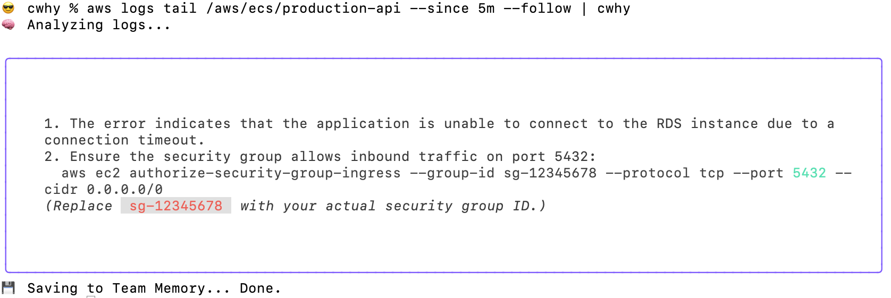
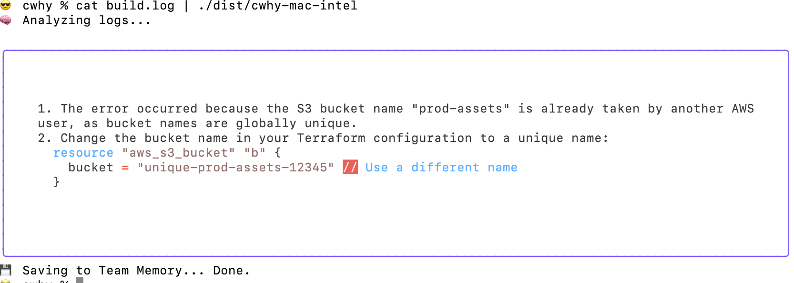

# cwhy ⚡

**The AI Debugger for your Terminal.**

`cwhy` explains your error logs and provides one-click fixes using AI. It caches successful fixes to a shared Team Memory, so you never fix the same bug twice.

### 1. Fix CloudWatch Logs 

 

### 2. Fix Build Errors 



## Why?
DevOps logs are ugly. Stack traces are painful.
- **Stop Grepping:** Don't read 500 lines of JSON.
- **Stop Googling:** Get the exact `kubectl` or `terraform` command to fix it.
- **Stop Repeating:** If someone else fixed this bug last week, `cwhy` remembers the solution.

## Install

Find your OS below and run the command to download the binary.

**Mac (Apple Silicon / M1 / M2 / M3):**
```bash
curl -L https://github.com/faalantir/cwhy/releases/download/v0.1.0/cwhy-mac-arm64 -o cwhy
chmod +x cwhy
sudo mv cwhy /usr/local/bin/
```

**Mac (Intel):**
```bash
curl -L https://github.com/faalantir/cwhy/releases/download/v0.1.0/cwhy-mac-intel -o cwhy 
chmod +x cwhy 
sudo mv cwhy /usr/local/bin/
```
**Linux:**
```bash
curl -L https://github.com/faalantir/cwhy/releases/download/v0.1.0/cwhy-linux-amd64 -o cwhy
chmod +x cwhy
sudo mv cwhy /usr/local/bin/
```

**Windows:** Download `cwhy-windows.exe` from the [Releases Page](https://github.com/faalantir/cwhy/releases).


## Configuration

You only need your OpenAI Key.

```bash

export OPENAI_API_KEY="sk-..."

```

## Usage

**1. The "Pipe" Method (Recommended):** Pipe any error directly into `cwhy`.

```bash
terraform apply | cwhy
docker logs my-container | cwhy
cat build.log | cwhy
```

**2. The "Paste" Method:**
```bash
cwhy "Error: AccessDeniedException: User is not authorized to perform: s3:ListBucket"
```

## How it works

1.  **Hash:** We create a unique fingerprint of the error.
    
2.  **Search:** We check the Shared Memory to see if this error has been solved before.
    
3.  **Solve:** If found, we show the fix instantly (Free). If not, we use AI to generate a fix and save it for the next person.
    

----------

## Roadmap
- [ ] Support for **Anthropic (Claude)** and **Perplexity**.
- [ ] Support for Local LLMs (**Ollama**).
- [ ] "Interactive Mode" to apply fixes automatically.

_Built with Go, OpenAI, and Supabase._